# Jira Basic Foundations

### Jira helps you track your work

Think of Jira as a to-do list for your entire team. It helps you plan, track, and ship world-class work.

Jira is for all types of teams, including agile teams, software development teams, and marketing teams. Whether you're on a team of five or 5,000, Jira keeps all your work in one place.

👇This is an example of what Jira can look like. Your version may look different!

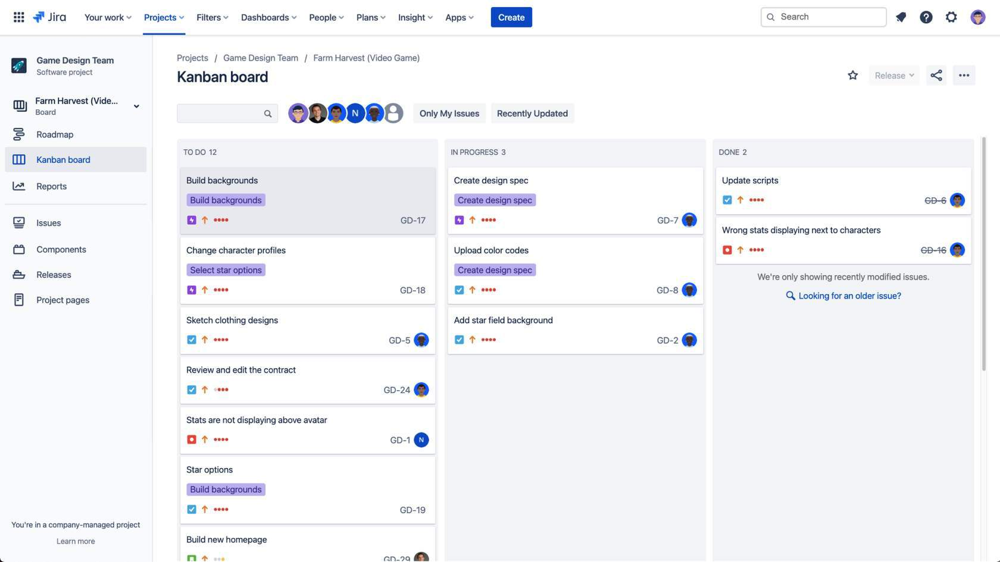

### How does your team use Jira?

Managing work in Jira helps your team be more transparent, efficient, and collaborative.

✔ Transparency: Everyone on your team can view and comment on your work. You don’t need to work in silos.

✔ Efficiency: Your team can plan ahead by breaking down big projects and knowing exactly when work will start and end. 

✔ Collaboration: You can work closely with your teammates, organizing your discussions and decisions

### How can you use Jira?

Along with being a better teammate, Jira makes it easy for you to focus on the work that matters.

✔ Prioritize your most important work items
✔ Plan your week by visualizing upcoming work
✔ Find answers and ask questions about your work items
✔ Stay up to date on your teammates' work
✔ Share progress with their team

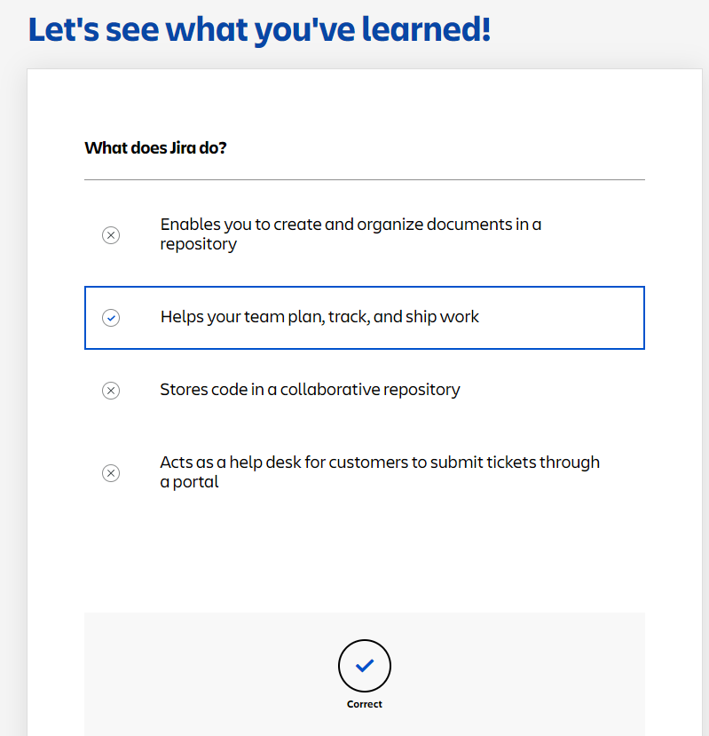

# Explore issues, projects, and boards

### What’s an issue?

In Jira, individual work items are issues. You'll update issues to show work progress or add relevant information, like notes from a meeting or a question for a teammate.
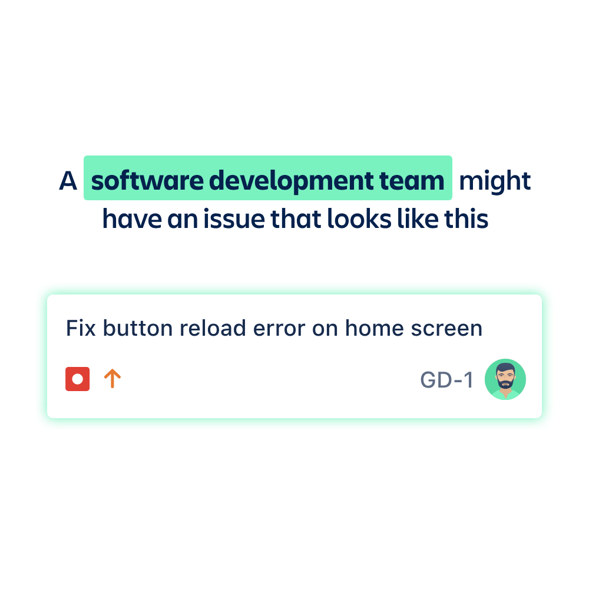
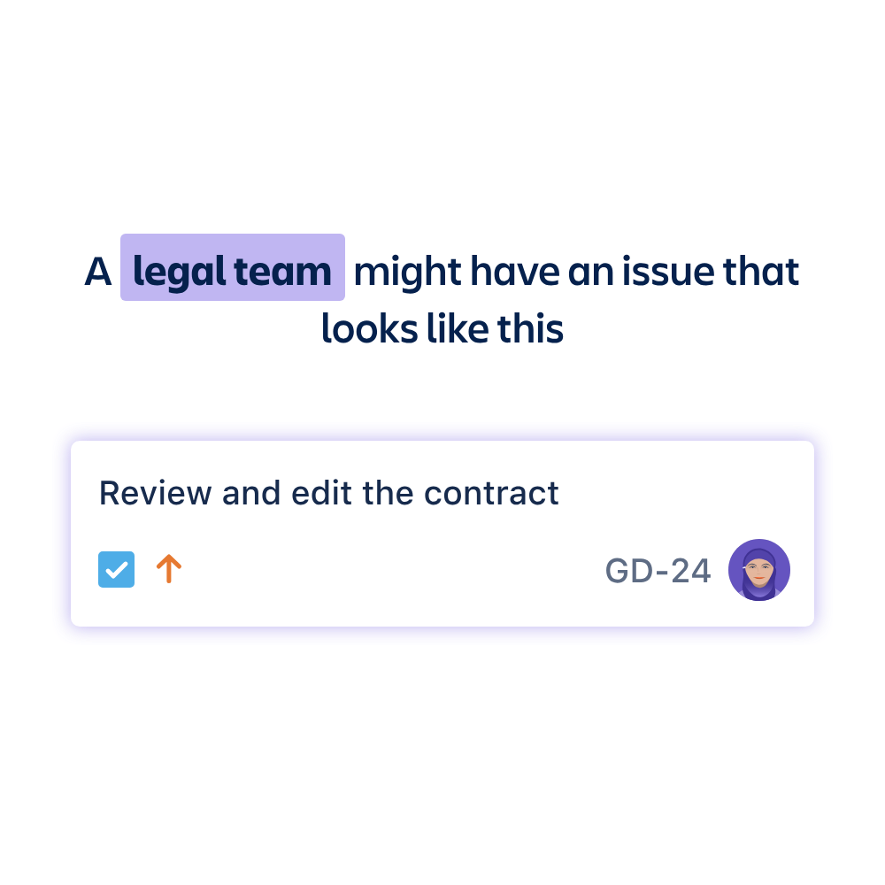
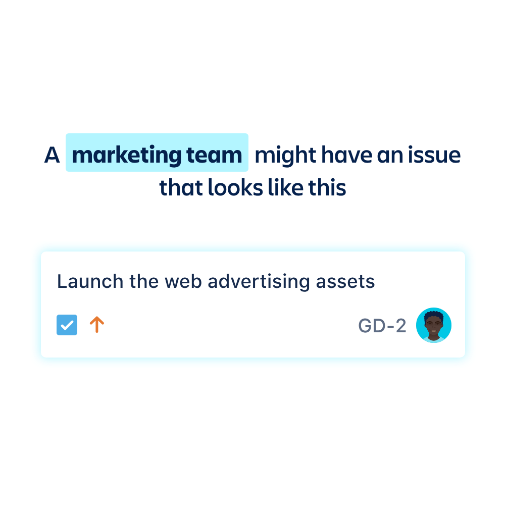

Issues can vary in size depending on how your team uses them. Some issues take months to complete. Others finish in a few hours. Like most things in Jira, you can use issues however works best for your team.

### What’s a project?

A project is a collection of related issues. In Jira, every issue belongs to a project. 

Teams can use projects differently depending on how they want to categorize and organize work.

👉 For example: You can use a project to track all of the work for a team. Your project might be "Game Design Team," "Marketing Team," or "Legal Team."

👉 Another example: You can use a project to track a larger deliverable, like an app version release or large marketing effort. Your project might be "Vidzi App Release V2.7" or "Fall Marketing Campaign."

To see all of your projects, find the main navigation bar and click Projects. This will show you a list of all projects you can view. When you’re working in a project, you can see its name in the upper left.

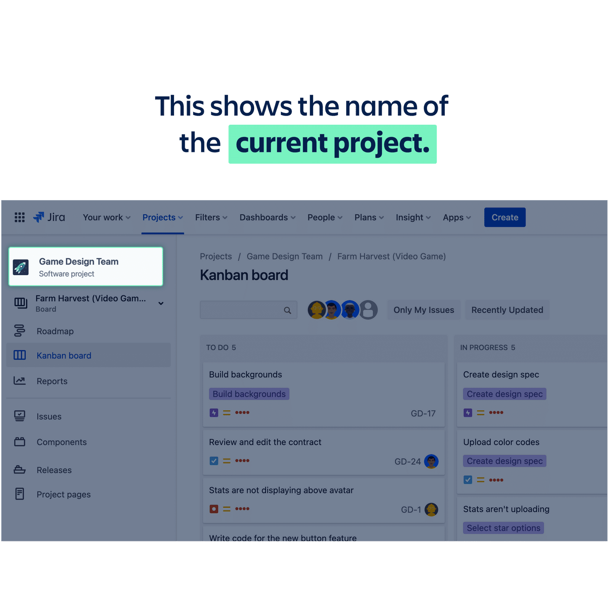
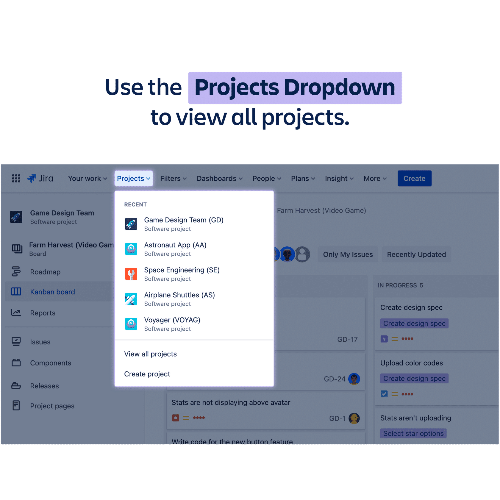

Project keys are short versions of the project name that identify the issues in that project. 

👉 For example: If the project key for your Game Design Team project is GDT, issues within that project will be GDT-1, GDT-2, and so on.

### What’s a board?

A board is a visualization of the work in a project. Boards have columns with issues in them. The columns represent the statuses that your work, represented by issues, moves through. Your entire board represents your team’s workflow, the path of statuses an issue moves through.

👉 For example: Kate’s team uses the marketing team board to track their work. Their work moves through three statuses, To Do, In Progress, and Done. Their board has three columns, one for each status. When Kate starts working on an issue, she moves it from the To Do column to the In Progress column.

👇In this example, the issue card "Build backgrounds" moves through the workflow: To Do to In Progress to Done.

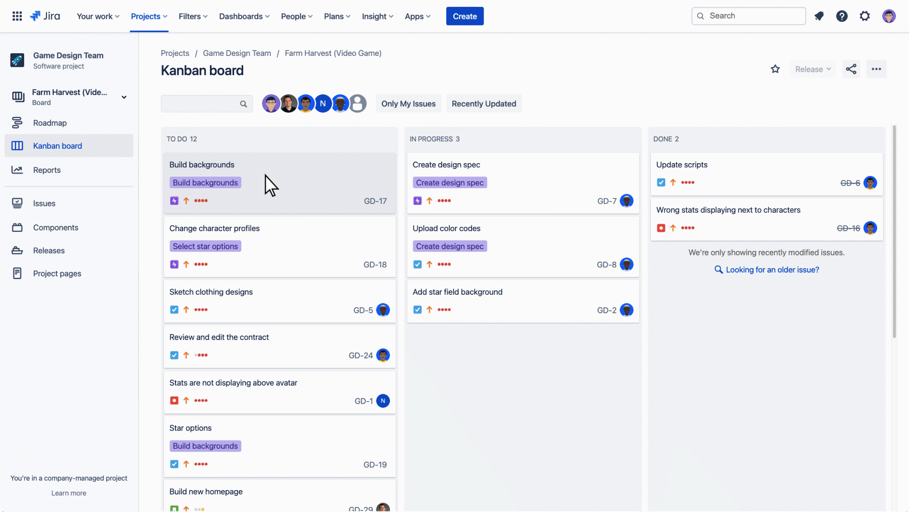

Boards belong to projects. A single Jira project can have several boards, depending on its configuration. 

👉 For example: The Legal department has three boards in their project: Contracts Team, Acquisitions Team, and Patents Team. Each board tracks work for a different team within their department.

👉 Another example: Lei’s team has multiple boards within the Game Design Team project. Their boards show work related to the games they're working on: Farm Harvest, Galaxy Action II, and Street Car Racer.

There are two types of boards in Jira. Kanban boards support a continuous flow of work. Issues move in and out of the board from the start of the project until the end of the project. Scrum boards track groups of issues that the team completes during a fixed period of time, often a two-week "sprint." After a sprint completes, the team creates a new sprint for the next group of issues they want to work on.

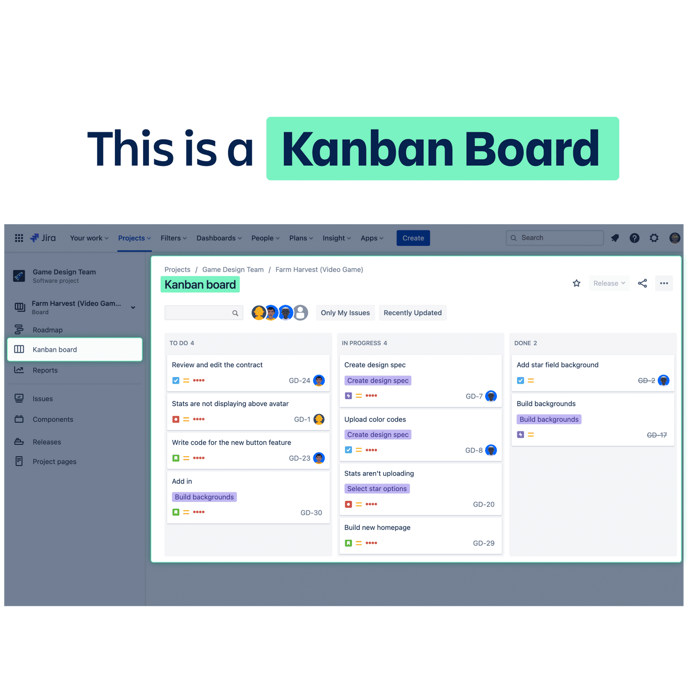
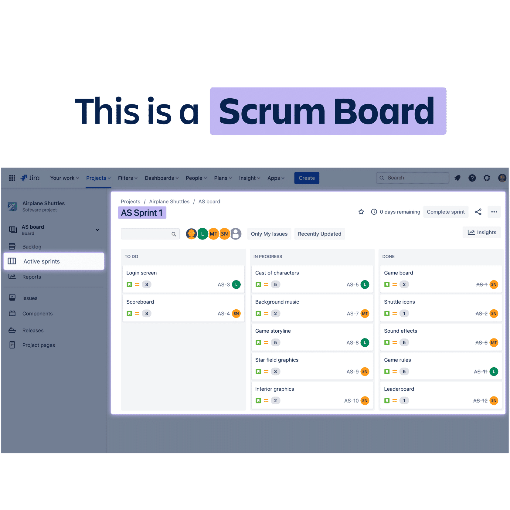

# Navigate around Jira

To find your projects, boards, and issues, and to see other teams' work, you’ll need to know how to move around Jira.

👇Click the icons below to learn how to find what you need in Jira.

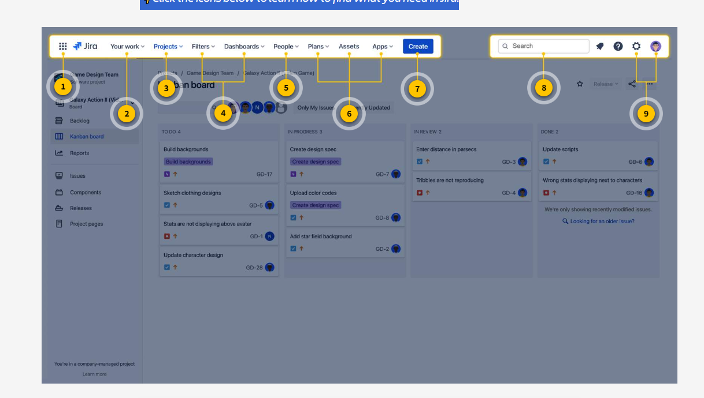

Prefer to see a list of the main navigation options? Click here.
Product switcher: Allows you to switch to other Atlassian products your team may be using, like Confluence or Bitbucket.

    Your work: Shows issues, projects, and boards you’ve recently visited and allows you to view all work assigned to you.

    Projects: Shows a list of all of your projects and enables you to create new projects.

    Filters and Dashboards: Shows saved or starred filters and dashboards.

    People: Shows a list of the people and teams you interact with most.

    Plans, Assets, and Apps: Shows your plans and apps installed on your Jira instance (for Premium users only).

    Create: Enables you to quickly create new issues.

    Search: Helps you find issues, projects, boards, queues, filters, and people.

    Settings and Profile: Enables you to customize your personal settings, set up your profile, and control email notifications.

Note: The options in your navigation bars may look different. Navigation bars depend on your site settings and team preferences.

# Navigate in a project

You’ll likely spend most of your time in Jira in a project, so let’s explore one.

👇Click the icons below to learn how to find what you need in a project.

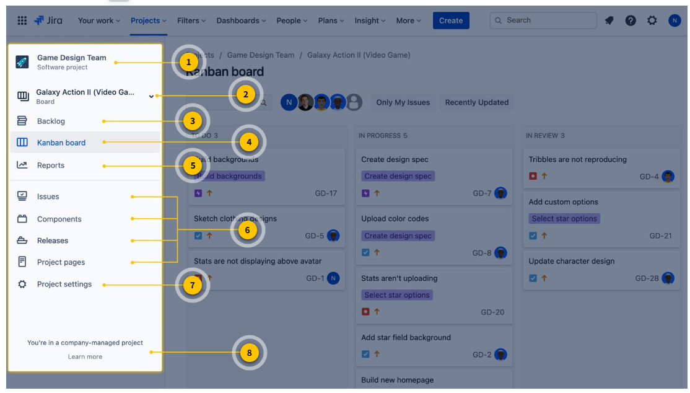

Prefer to see a list of the main navigation options? Click here.
    Project name: Shows the current project you are in.

    Board switcher: Allows you to switch between different boards in this project.

    Backlog: Allows you and your team to define and plan issues before starting to work on them.

    Board: Shows the selected board.

    Reports: Shows reports for your project’s data.

    Other options: Issues shows you all issues in the project. The Components, Releases, and Project pages are optional project configurations that your team can customize to track your work.

    Project settings: Shows your project’s settings, if you’re a project admin. Project admins can edit project details, update permissions, and create workflows, among other responsibilities.

    Project type indicator: Shows whether your project is team-managed or company-managed. These project types are pretty similar, but you may have different features and functionality depending on your project type.

Note: Depending on your project’s configuration, you may see other views in your project, like the timeline, list, or calendar. You also might not see some of the features in this example project.

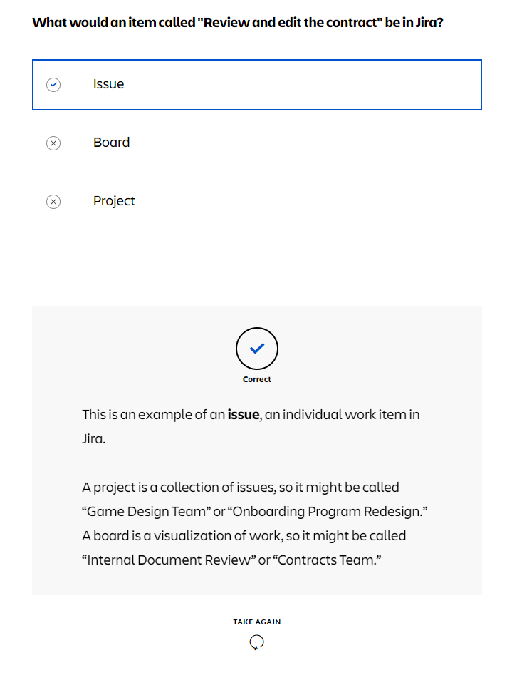
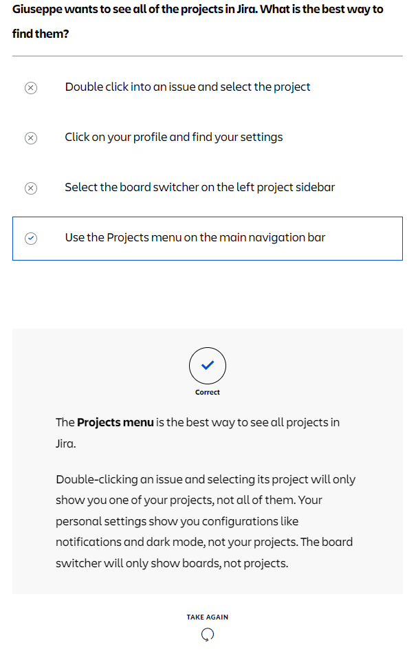

# What are the types of issues?

With a wide variety of work, teams need different ways to categorize their different issues. The issue type tells you the category and size of the work an issue represents.

👉 For example: The subtask issue type indicates this work is just one piece of a larger deliverable.

👇 To identify an issue type, hover your mouse over the issue type icon.

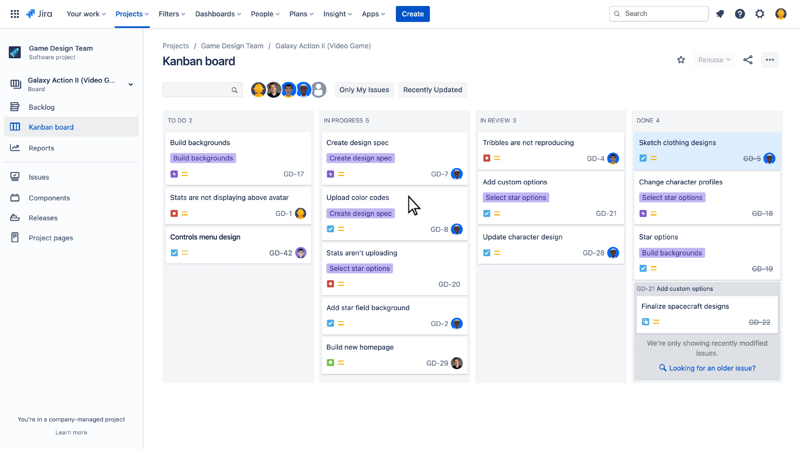

### Epic
An epic represents a large body of work that can break down into smaller chunks.

👉 For example: You might create an epic for a redesign of a homepage, or writing and publishing a series of blog posts.

Known as "parent" issues, epics contain smaller issues within them. You and your team can decide what's a large body of work and what isn’t.

### Story
A story is a deliverable from the user's perspective. They define work items in non-technical language. 

👉 For example: A story titled “Design return function†might have this description: “As a user, I need a back button on this screen."

### Task
A task contains a detailed description of a work item, usually from your perspective.

👉 For example: A task titled “Review survey data†might have a list of metrics that you want to analyze and specific requirements for your review.

### Bug
A bug describes a problem or error. 

👉 For example: You might use a bug to represent the work needed to investigate and determine a solution for a broken button on your website.

### Subtask
A subtask is the smallest piece of work, just one step toward completing a larger issue. 

👉 For example: You might have a story called “Send marketing email†with several subtasks. One of the subtasks could be “Test subject lines for effectiveness.â€

Subtasks must have a parent issue type. They can't exist on their own.

Jira organizes these issue types into a hierarchy based on the size and category of work.

👇 This is the hierarchy of the default issue types.

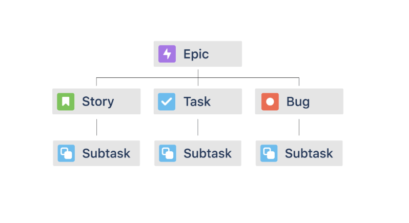
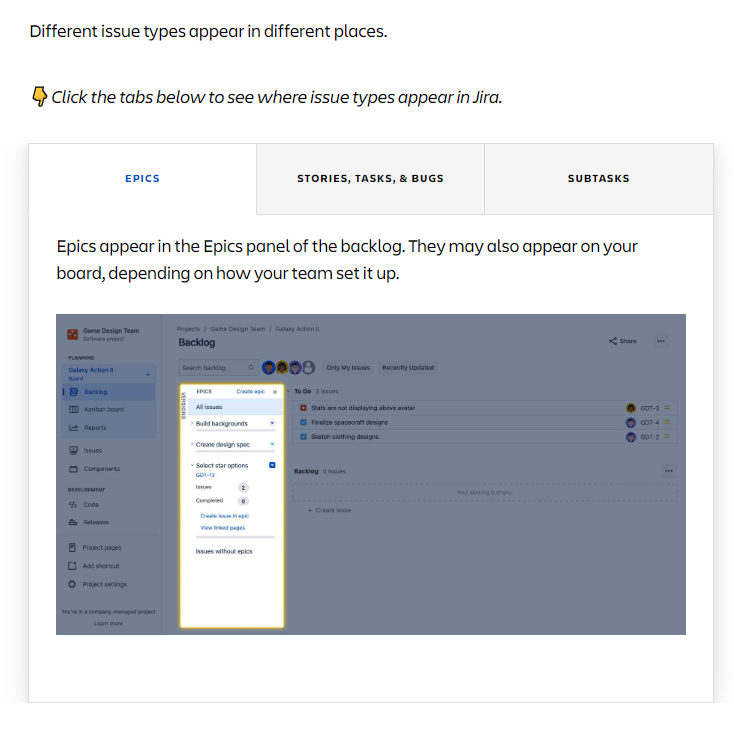
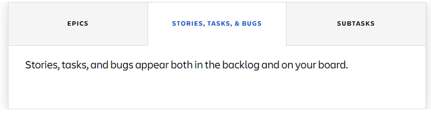
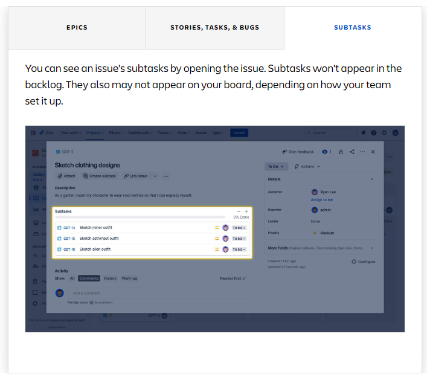

### Let's look at an example.

Imagine a game design team building a space-inspired video game. 

👇 Click the tabs below to see how the game design team uses issue types.

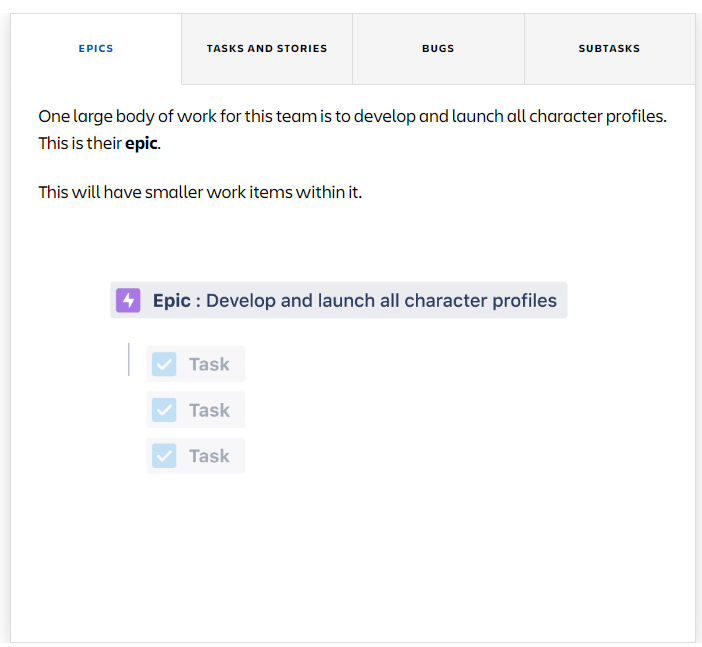
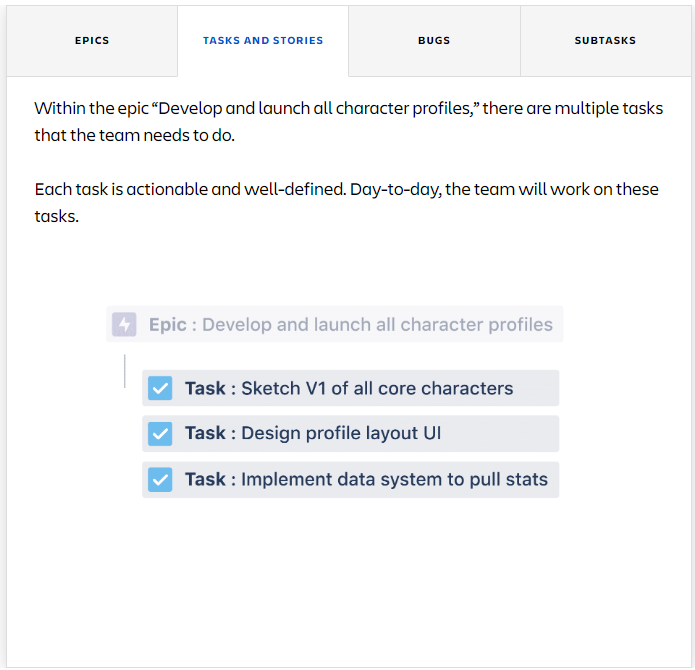

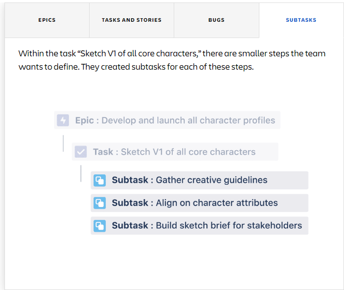